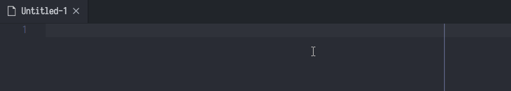

# cwt (10086)
cwt 是一个简单的 VSCode 中文写作重复检查插件。它会高亮所有位于光标下方的词语的重复。

因为分词性能原因，cwt 默认关闭。若要启用，在相应文件内使用命令“CWT: Start Repetition Detection in this Document”即可。

## FAQ
### 为什么不会工作？
请打开命令面板（Windows 下默认 Ctrl + Shift + P），输入“CWT: Start Repetition Detection in this Document”并按下回车来启用当前文档的重复检查。

### 为什么我的高亮相关的设置被改了？
因为 cwt 重复显示依赖于高亮，VSCode 本身也提供高亮。两个高亮会叠在一起导致看不出来。因此 cwt 会默认在打开启用重复检查的文档中禁用 VSCode 本身的高亮，并在退出时还原。如果你不希望 cwt 那么做，请使用命令“CWT: Restore and Disable Configuration Overrides”。

### 为什么我近距离重复高亮有时候莫名其妙没了？
因为我研究了很久都没有研究出如何监听某个词语被修改的事件。因此我只能采用一些比较鬼畜的方法来检测什么时候这个重复的词语被删除了。这个鬼畜的方法的缺陷就是如果在触发近距离重复高亮的那个词语之前增加或删除字符就会误判重复终止了，并停止高亮。个人在使用的时候没有发现这个会造成什么问题。
